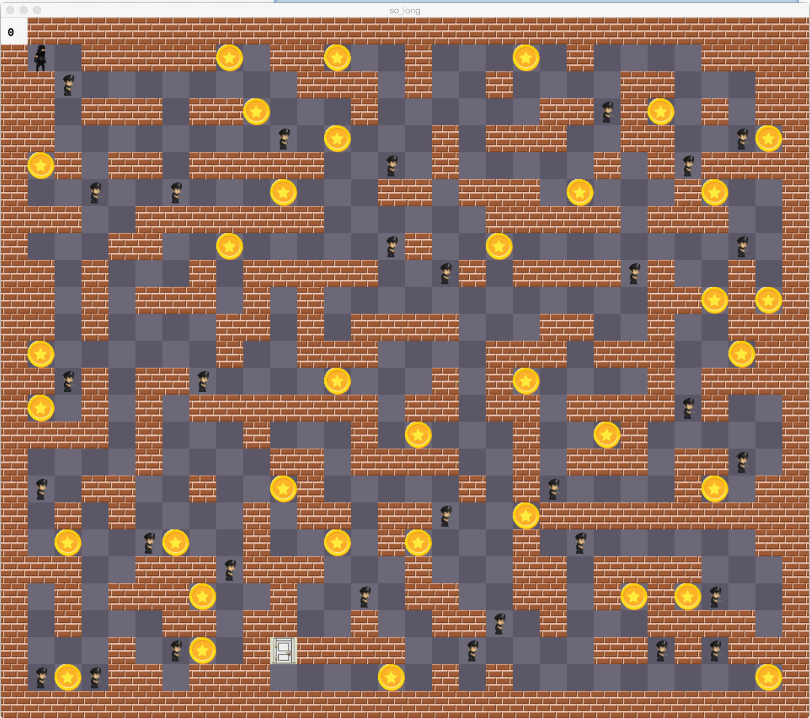

# So_Long_42

## Poject Object
So long is a 42 project that allows you to learn about computure graphics

## Project goals
The goal from this porject is to create a game using Minilibx, the game must contian walls, coins, exits and one player, for bonus you must have some sprite animation and enemies

**Minilibx docs**

https://harm-smits.github.io/42docs/libs/minilibx

## Project usage

Clone this repository and run **make**

```git clone https://github.com/YassineEddyb/So_Long_42```

Then execute so_long file with any map in the maps folder for example :

```./so_long maps/maze.ber```

<h3>Image from project</h3>

